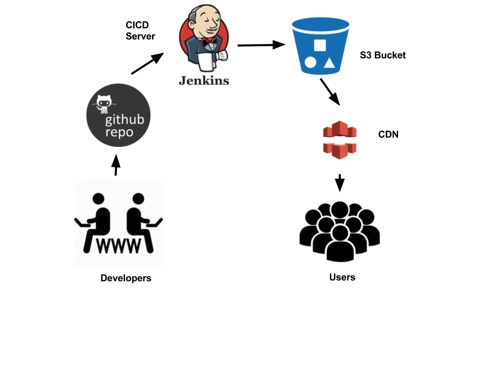

## Using Ansible and AWS to create a CI CD pipeline for Static Website



### Pre-Requisites:
Here we assume you have the following on your local machine
 - boto
 - python2.7
 - keys placed in `~/.boto`
 - ansible

### Instructions to Run

`deploy-webapp.yml` playbook does the following as of now:

- create a security group named my-sec-grp which allows ssh, http, https
from any ip address.
- create two ec2 instances named `server1` and `server2`  

Before running add the following to `/etc/ansible/hosts`

```
[local]
localhost
```

To Deploy, execute the following

```
ansible-playbook -i /etc/ansible/hosts deploy-webapp.yml
```

### Work Done:
  - deployed a cloudformation stack to provision  the following :
      - EC2 Instance (CICD Server)
      - S3 Bucket which holds contents of the static website
      - CloudFront Distribution
  - ansible role to install git on CICD Server


### TODO:
  - Role to install jekyll (static site generator) and its dependencies
  - Role to install Jenkins
  - Role to install github plugin for Jenkins
  - Role to install aws-cli on CICD Server


#### Author:
Ajinkya Kadam
